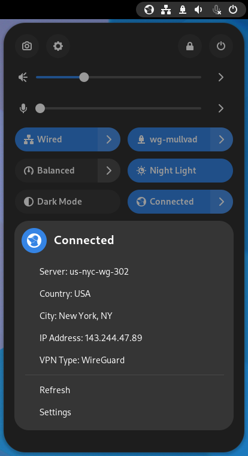
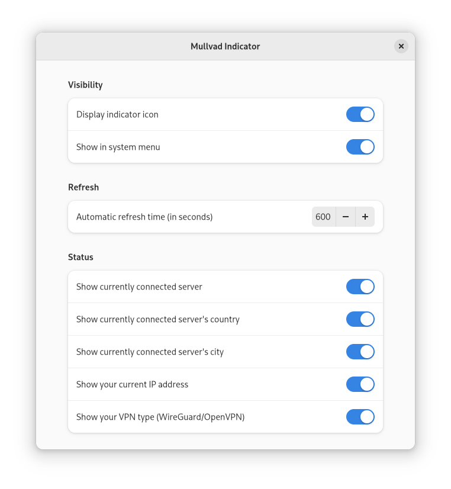

# Mullvad Indicator

System tray indicator for Mullvad VPN. Monitors your connection and allows you to view connection details from the system tray.

# Import note

This is maintained on a best-effort basis as I am no longer a Mullvad VPN subscriber. In addition Gnome is constantly changing GnomeJS which causes the extension to break on every new major Gnome release. There is a fair amount of toil involved in just keeping this extension up-to-date for whatever changes the Gnome devs have made to break extension backwards compatibility.

I am active on Github and willing to accept PRs/submit to extensions.gnome.org, but I am not actively maintaining this project anymore. Please feel empowered to contribute!

## How it works

The extension listens for 'network-changed' events from [GNetworkmonitor](https://developer.gnome.org/gio/stable/GNetworkMonitor.html) and will poll Mullvad's `https://am.i.mullvad.net/json` API using Gnome's [libsoup](https://developer.gnome.org/libsoup/stable/) to get the system's current Mullvad connection status.

## Issue reporting

If you run into any issues feel free to report them here. Please include logs from Gnome's [Looking Glass](https://wiki.gnome.org/Projects/GnomeShell/LookingGlass) if possible/applicable.

## Feature requests & Forks

Pull requests are always welcome, but please try to stick to Gnome's [GJS Style Guidelines](https://wiki.gnome.org/Attic/Gjs/StyleGuide).

In addition you're of course welcome to fork this repo if you'd like, but please be kind and send back any changes that may be relevant here :)

## Screenshots

## Special thanks
 * The authors of http://gjs.guide/
 * [no-comma](https://github.com/no-comma) for the Gnome 43 port and slight UI overhaul.
 * [zacius](https://github.com/zacius) for testing and being patient with me when I broke the master branch :')
 * [andyholmes](https://github.com/andyholmes/) on #extensions:gnome.org who helped with some particularly nasty code issues as well as reading his projects to learn Gjs.
 * [quasipedia](https://github.com/quasipedia) whose [NordVPN Gnome extension](https://extensions.gnome.org/extension/1347/nordvpn-status/) I relied on heavily.
